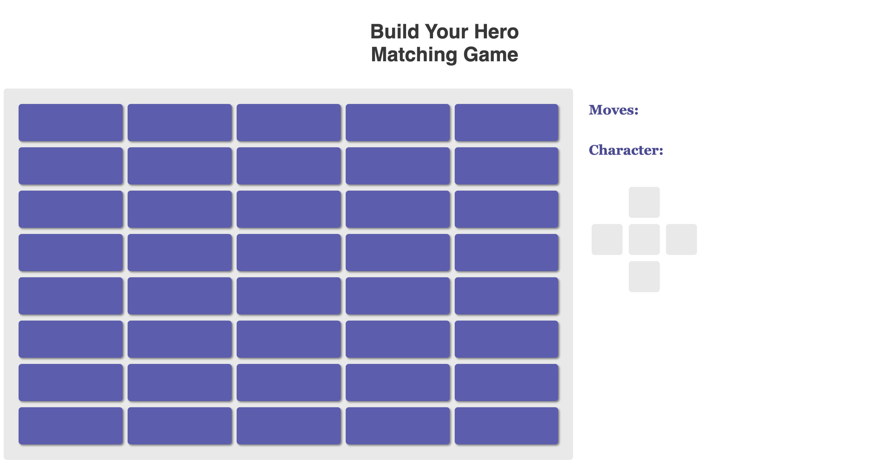
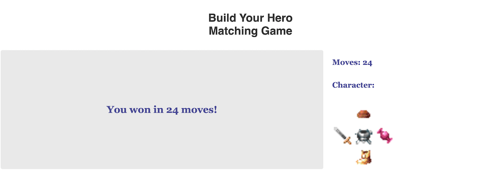

# Build Your Hero Matching Game

This is a matching game with a twist!

Flip over cards two at a time to try and match up the pictures, and for the first match you get in each category - hats, weapons, armor, food, and shoes - that piece of equipment gets added to your character.

The goal is to build up a complete character in as few moves as possible. (For an extra challenge, try to build a character with matching armor!)

To run the game locally on your machine, simply clone the repo, run npm install to install browserify, run npm start to generate the bundle, and then open the index.html file in your browser.

Enjoy! :)
